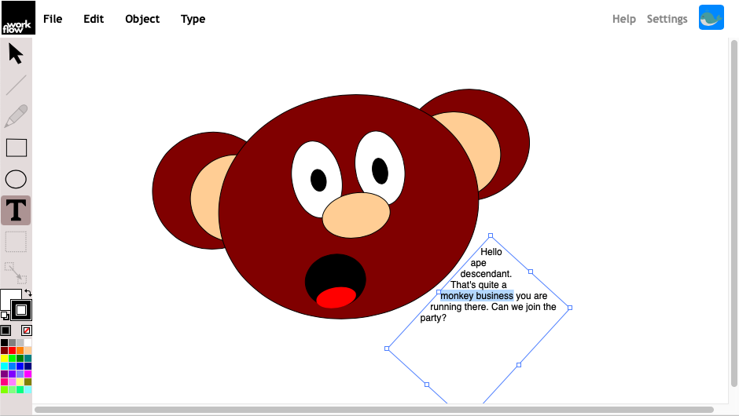

#  A Collaborative Real-Time White- and Kanban Board

<p align="center"></p>

## Current Status

Take a look 👉 <a href="https://markandre13.github.io/workflow/">Live Demo</a>

* add rectangles, circles and text
* move, scale, rotate, delete, set stroke and fill color
* maintain drawing in the browser's permanent storage using IndexedDB
* export/import drawing to/from local file encoded in ISO/IEC 19500-2
* various annoying glitches and usability issues which are being worked on! 😅

**Please Note**: exports may not load in upcoming versions yet

## Goal

Workflow is intended for everything related to 2d vector graphics.

The target is users as well as artists/software developers who want to tweak and extend their tools and have the source code as well as the created artwork available in an open non-proprietary format.

The name _Workflow_ was choosen to indicate a tool which can be adjusted to the user's workflow.

## Vector Graphics (In Development)

Providing decent vector graphics support 

* basic shapes like rectangle, circle, ...
* text
* bezier paths
* freehand
* boolean operations
* flood fill
* bitmap images
* transformations (perspective, etc.)

Note: Last time I looked at Inkscape, their algorithms leave something to wish for, eg.
* Inkscape's flood fill converts the image to a bitmap, fills that and converts the result back to a vector graphic. the result depends on the current zoom level.
* Inkscape's ink tool doesn't use all the pen's data (pressure, rotation) to emulate the nib.

## Manga/Comic (Planned)

I've been a user of Manga Studio/Cell Studio Paint and one of the biggest drawbacks for me was it's inability to export vector graphics. Hence the plan is to support the following features in Workflow:

* Screentones
* Panels
* Rulers
* Speech Bubbles
* Pages
* Page Templates

## Software Development (Planned)

I'm a software developer and most of the time the diagrams I draw are done as ASCII art because it is easy to create and share.

Hence the plan is to add support for various UML Diagrams

## Collaborative Real-Time (Planned)

The code currently contains a limited proof of concept. For a production ready implementation WebRTC and CRDTs will be required.

## Scrum/Kanban Board (Planned)

This is the idea which got Workflow started in the first place:

Managing the software development process through Lean/Agile methodologies
means to apply the same steps used in creating an algorithm to the software
development process itself:

    • design the algorithm (Plan)
    • implement the algorithm (Do)
    • test the algorithm (Check/Study)
    • release the algorithm (Act/Adjust)

A tool to visualize the software development process and to give the team
ownership of it's process, is the Kanban board as described in Henrik
Kniberg's seminal book <a
href="https://www.crisp.se/file-uploads/Lean-from-the-trenches.pdf">Lean
from the Trenches</a>.

When compared to what Kniberg did for the Swedish police, electronic kanban
boards, like Jira, et al., place a lot of restrictions on what can be done to
the board.

Some restrictions are owed to the hardware

 * limited screen space
 * single user interface (one mouse & one keyboard)
 * no haptic experience
 * restricted face to face communication between developers

But some might be overcome by large, high-resolution touch screens and/or by
turning each developers phone/tablet into a input device.

Other restrictions are owed to the software and the organizations which run
them:

 * kanban board with only columns and lanes
 * no notes, descriptions, drawings, etc. on the kanban board
 * no undo/redo
 * no collaborative real-time interaction
 * screen sharing makes it annoying to switch temporarily to another application
 * sometimes all changes to the board structure have to go through an
   unwilling administrator
 * sometimes management doesn't want everything to be put on the board
   because it might look bad to outsiders
 * no API to use custom algorithms to analyse the data
 * separate Wiki which lacks decent support for flowcharts, UML diagrams, ...
 * separate Chat (ie. Workflow could highlight/enlarge/animate the cursor of the person speaking)
 * separate Chatroom and likely not threaded like Reddit or imporant comments not markable as sticky
 * not suited for sophisticated illustrations
 * not open source, so you can not extend/change/fix it
 * etc.

 Then there are also restrictions with physical boards:
 * no anonymous dot voting
 * can only be archived by taking a photo
 * etc.

Workflow aims to be a Kanban board which is not less but more than a building
plastered with whiteboards.

## Toolchain

* [Pure ESM Module](https://gist.github.com/sindresorhus/a39789f98801d908bbc7ff3ecc99d99c) toolchain
* [Web Test Runner](https://modern-web.dev/docs/test-runner/overview/) for test execution 

  Run's ESM files in a browser using [Mocha](https://mochajs.org))

* [Web Test Server](https://modern-web.dev/docs/dev-server/overview/) for running the application during development

  Serves ESM files and provides Hot Module Reload (HMR)

* [TypeScript](https://www.typescriptlang.org) for catching obvious errors at compile time.

  When run with --watch, usually compiles within less than a second, putting it
  en par with [swc](https://swc.rs) and [esbuild](https://esbuild.github.io) in regards
  to performance while also providing newest language features. (E.g. 'override')

* [ttypescript](https://www.npmjs.com/package/ttypescript) to compile directly to ESM

* [rollup.js](https://rollupjs.org/) for production bundling

I usually run all tools in watch mode for best performance. Each of them in a separate terminal window.

### Coding
```
     npm run dev:compiler
     npm run dev:server
```

### Testing
```
    npm run dev:compiler
    npm run test:server
```

workflow is developed along with toad.js and corba.js. I sometimes work directly with the local repositories using `npm link toad.js corba.js` and also compile them using 'npm run dev:compiler'.

## Server

*PLEASE NOTE*: To ease the development of the client side, the server is not working yet.

Workflow needs a HTTP Server and the Workflow server provided in

    js/server.js

The index.html page contains the URL under which the workflow WebSocket
server is available.

The workflow server doesn't yet support SSL.  If you need security
(recommended), you can use an Apache as SSL proxy.

### Direct Connection to workflow Server

By default the web app will contact the workflow server directly via

    <body onload="workflow.main('ws://'+window.location.hostname+':8000')"></body>

### Apache as WebSocket Proxy

It is also possible to route the traffic through Apache. For this you will
need to enabled some modules

    a2enmod proxy proxy_wstunnel

and configure the proxy, ie. in

    /etc/apache2/sites-available/000-default.conf

by adding

    ProxyPreserveHost On
    ProxyRequests off
    ProxyPass "/workflow/" "ws://192.168.1.105:8000/"

tweak index.html like this

    <body onload="workflow.main('ws://'+window.location.hostname+'/workflow/')"></body>

and restart Apache

    apachectl -k graceful

### Apache as Secure WebSocket Proxy

In case your web server is not already providing SSL, enable the Apache SSL module

    a2enconf ssl

generate SSL certificates

    cd /etc/apache2
    mkdir ssl
    cd ssl
    openssl req -x509 -newkey rsa:4096 -keyout private.pem -out certificate.pem -days 3650 -nodes

and in

    /etc/apache2/sites-available/000-default.conf

copy the `<VirtualHost *:80>` section and rename it into `<VirtualHost *:443>`
and enable SSL with the available certificates

    SSLEngine on
    SSLCertificateKeyFile /etc/apache2/ssl/private.pem
    SSLCertificateFile    /etc/apache2/ssl/certificate.pem
    # SSLCACertificatePath  /etc/apache2/ssl/cacert.org
    BrowserMatch "MSIE [2-6]" nokeepalive ssl-unclean-shutdown downgrade-1.0 force-response-1.0
    BrowserMatch "MSIE [17-9]" ssl-unclean-shutdown

tweak index.html like this

    <body onload="workflow.main('wss://'+window.location.hostname+'/workflow/')"></body>

and restart Apache

    apachectl -k graceful
