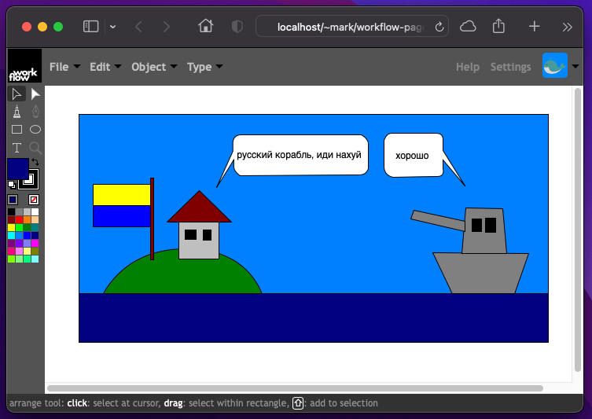

#  A Collaborative Real-Time White- and Kanban Board

## Current Status

Take a look 👉 <a href="https://markandre13.github.io/workflow/">Live Demo</a>

* add rectangles, circles and text
* move, scale, rotate, delete, set stroke and fill color
* maintain drawing in the browser's permanent storage using IndexedDB
* export/import drawing to/from local file encoded in ISO/IEC 19500-2
* various annoying glitches and usability issues which are being worked on! 😅

**Please Note**: exports may not load in upcoming versions yet

* [Goal](doc/GOAL.md)
* [Development](doc/DEVELOPMENT.md)
* [Figure Editor Architecture](doc/FIGUREEDITOR.md)
* [Server](doc/SERVER.md)
